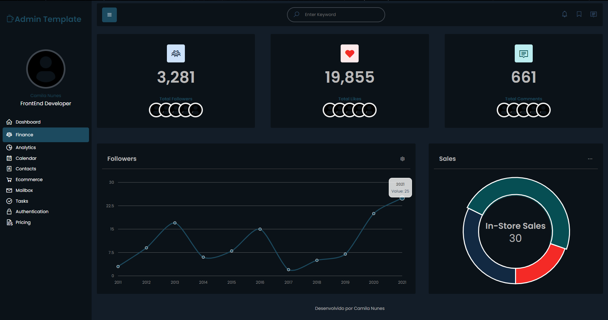

# Dashboard Template Admin Dark

<h1 align="center">
    <a href="">🔗 Dashboard  Template Admin Dark</a>
</h1>

🚀 Um projeto com intuito de montar um portfóliode frontend. Esse Template está sendo construindo apenas com HTML5, CSS3 e Javascript.

<h2 align="center"> 
	🚧  Projeto Em construção...  🚧
</h2>

### Features

- [x] Menu Lateral
- [x] Menu no Canto Direito Superior
- [x] Cartões
- [x] Inclusão dos Gárficos
- [ ] Responsividade

# Imagens do Projeto(Ainda em construção... 🚧🚧)

<h1 align="center">
  
</h1>